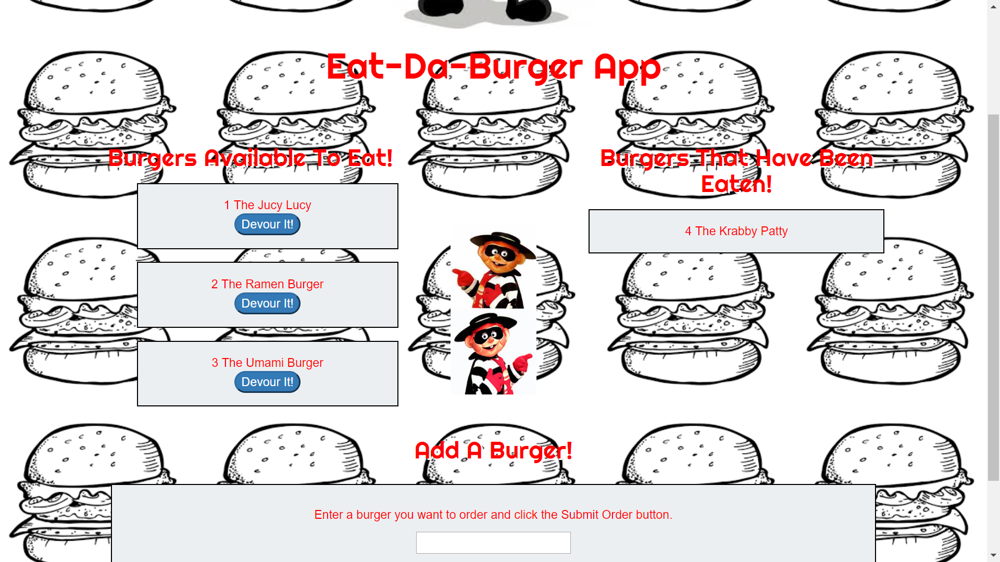

#  Eat-Da-Burger App 
The Eat-Da-Burger app is a burger food log that uses MySQL, Node, Express, Handlebars and ORM. I made sure to follow the MVC design pattern; use Node and MySQL to query and route data in the app, and use Handlebars to generate the HTML.
 # 
 ### How The App Works
App lets users input the names of burgers they'd like to eat.
Whenever a user submits a burger's name, the app will display the burger on the left side of the page -- waiting to be devoured.
Each burger in the waiting area also has a Devour it! button. When the user clicks it, the burger will move to the right side of the page.
The app will store every burger in a database, whether devoured or not.
 ### To Run App
Follow the heroku link: https://young-scrubland-84445.herokuapp.com/